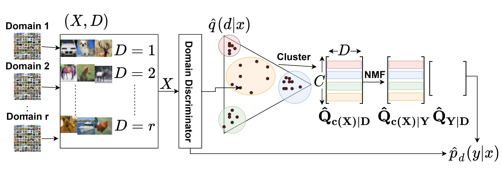

# Unsupervised Learning under Latent Label Shift
A new approach to unsupervised learning leveraging domain structure and invariance.

NOTE: this is a deprecated repository. Look for all future updates at [this repo on the ACMI Lab Github](https://github.com/acmi-lab/Latent-Label-Shift-DDFA/upload/main).

## Arxiv

[Paper](https://arxiv.org/abs/2207.13179) as Roberts*, Mani*, Garg, and Lipton.

## ICML 2022 SCIS Workshop
[Paper](https://openreview.net/pdf?id=CbxgFfEEP7P) as Mani*, Roberts*, Garg, and Lipton.

[SlidesLive Poster Session Video](https://icml.cc/virtual/2022/workshop/13461#wse-detail-19178)

## Authors

Pranav Mani*1
pmani@andrew.cmu.edu

Manley Roberts*1
manleyroberts@cmu.edu
  
Saurabh Garg1
sgarg2@andrew.cmu.edu
  
Zachary C. Lipton1
zlipton@cmu.edu

\*: Denotes equal contribution
1: Machine Learning Department, Carnegie Mellon University

## Use Instructions

- Install a recent version of Python 3 (we used Python 3.10.4).
- `pip install -r requirements.txt`
- You may receive errors for Pillow installation, if so follow instructions here: https://pillow.readthedocs.io/en/latest/installation.html
- Install ImageNet by the instructions at https://www.image-net.org/download.php and replace 'root folder' in ImageNet and ImageNetSubset classes in dataset.py with the root folder of the installation (one level above the train/validation split folders). The test dataset we use is composed of the validation dataset from ImageNet, the validation dataset is split out of the train dataset of ImageNet.
- Details on downloading the FieldGuide dataset can be found here https://sites.google.com/view/fgvc6/competitions/butterflies-moths-2019. Extract images from training.rar into '~/FieldGuideAllImagesDownload/'. Then run ./data_utils/create_FieldGuide_directories.ipynb to create the FieldGuide-28 and FieldGuide-2 train, val and test directories.
- Starting on line 215 of experiment_runner.py, replace "project" and "entity" with the appropriate project and entity for WandB.
- From https://github.com/wvangansbeke/Unsupervised-Classification, download CIFAR-10 SCAN Loss, CIFAR-100 SCAN Loss, and Imagenet-50 SCAN Loss pth.tar files into ./pretrain/scan_cifar_pretrain/ and ./pretrain/scan_imagenet_pretrain/, depending on the dataset.

## Attributions

Attributions are available in LICENSE_ATTRIBUTION
